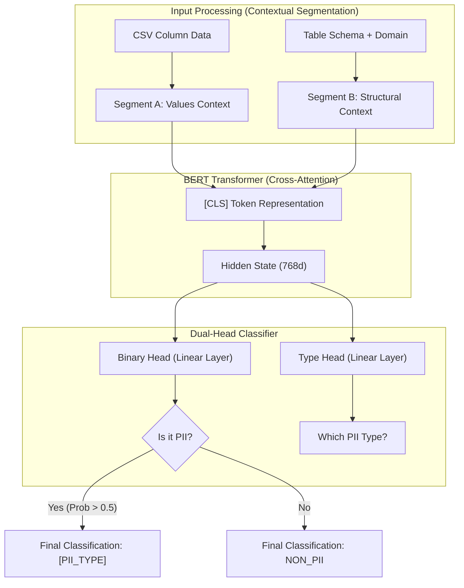
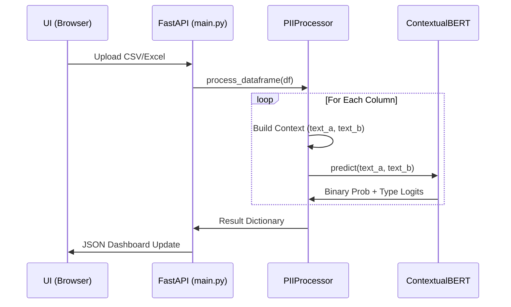
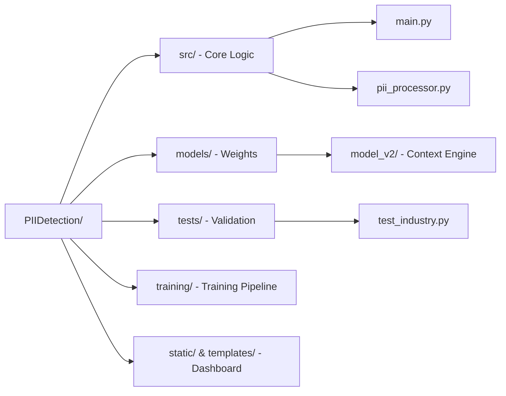

# PII Detection System - model_v2 Architecture

This document provides a technical breakdown of the `model_v2` logic, explaining how it achieves situational context-awareness using a Dual-Head BERT architecture.

## 1. Technical Overview
`Model_v2` is a **ContextualBERT** model. Unlike traditional PII detectors that look at strings in isolation, this model analyzes the relationship between the data values and the surrounding database schema.

### Data Flow Diagram

### System Interaction Flow

---

## 2. Project Repository Structure
Following the cleanup, the repository is organized as follows:

---

## 2. Deep Dive: How the Context Works
The core "intelligence" of the model comes from how we utilize BERT's **Segment Embeddings**.

### The Inference String
When you upload a file, the system doesn't just send the values. It constructs a two-part sequence:
- **`text_a`**: `column_name : value1 | value2 | value3`
- **`text_b`**: `domain: [domain], schema: [col1, col2, col3, ...]`

BERT performs **Cross-Attention** between these segments. It learns that:
- If `"PAN Card"` appears in `text_a` but the schema in `text_b` contains `"product_name"` and `"price"`, the probability of the Binary Head goes down (Result: **NON_PII**).
- If the same string appears and `text_b` contains `"kyc_table"` or `"customer_id"`, the Binary Head activates (Result: **PII**).

### The Dual-Head Logic
Instead of a single 31-class classifier, we use two heads:
1.  **Binary Head**: A specialized gate that only asks "Is this sensitive?" This is trained with **Focal Loss** to handle the fact that most data in the world is actually `NON_PII`.
2.  **Type Head**: A 30-class classifier that identifies the specific PII entity (e.g., `AADHAAR`, `PHONE_NUMBER`, `EMAIL`).

## 3. Training Strategy: Adversarial Context
To prevent the model from simply memorizing that "10 digits = phone," we used **Adversarial Training**:
- We generated thousands of "Dummy Catalogs" where real PII-looking values were used as "Item IDs" or "Serial Numbers."
- During training, we told the model these are `NON_PII`.
- This forced the model to **ignore the value** and **rely on the schema** to make the final decision.

---

## 4. Key Component Mapping
| Component | File Path | Role |
| :--- | :--- | :--- |
| **Logic Engine** | `src/pii_processor.py` | Builds the text_a/text_b segments from DataFrames. |
| **Model Loader** | `src/model_loader.py` | Unpacks the segments and runs GPU inference. |
| **Architecture** | `training/train_context_model.py` | Defines the `ContextualBERT` dual-head class. |
| **Generator** | `training/generate_synthetic_data.py` | Creates the adversarial templates for training. |
